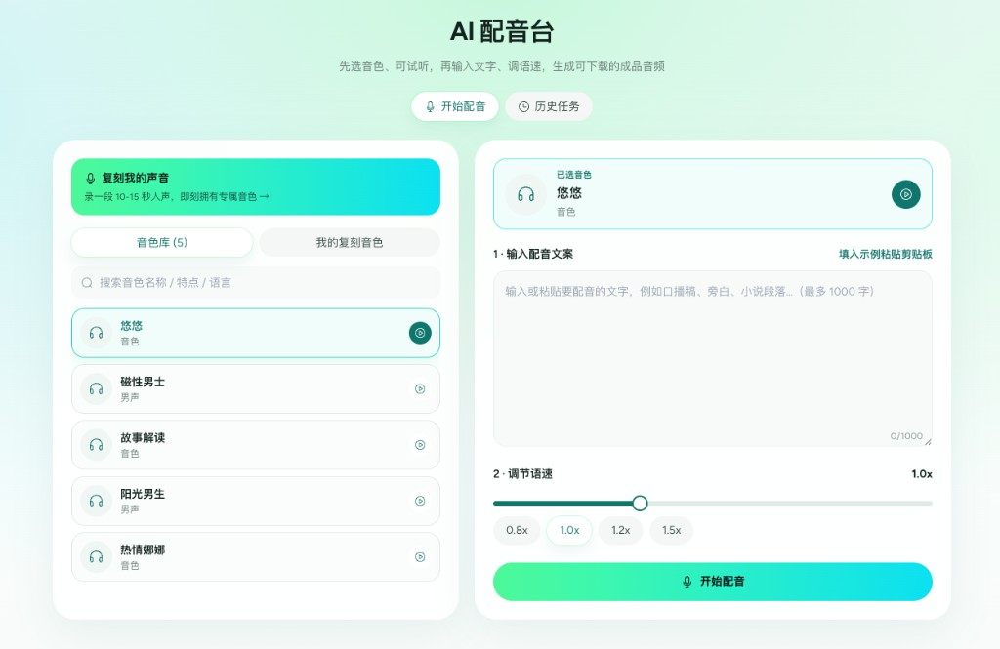

# 销豹 Agent Skills

你说要什么视频，Agent 负责做成片。

理解、数字人、剪辑由 Router 串好，和 [爆款智能体](https://xiaobao.ink/digital_human/agent) 是同一套能力，装在 Cursor / Codex 里。直连 [apis.xiaobao.ink](https://apis.xiaobao.ink/)，Key 只留在本机。本地素材会先上传；剪辑前按平台要求校验格式与时长。

- 体验成片：[爆款智能体](https://xiaobao.ink/digital_human/agent)
- 体验配音：[AI 配音台](https://xiaobao.ink/digital_human/ai_voice)
- 落地页：[https://xiaobao.ink/skills/](https://xiaobao.ink/skills/)
- 仓库：[xiaobaoAi/xiaobao-skills](https://github.com/xiaobaoAi/xiaobao-skills)

| Skill | 定位 |
|-------|------|
| `xiaobao-router` | **编排**：听懂目标，决定先理解、再数字人、再剪辑 |
| `xiaobao-video-agent` | **理解**：解析链接，取出文案、字幕和封面；不生成成片 |
| `xiaobao-digital-human` | **数字人**：公共音色直接配音；也可克隆声音、生成数字人视频 |
| `xiaobao-viral-agent` | **剪辑**：口播、素材混剪、新闻、包装；提交前校验素材，交付成片链接 |

用户不用点名 Skill。开发者安装 Router 后，由它决定调用顺序。

```bash
npx skills add xiaobaoAi/xiaobao-skills --skill xiaobao-router
bash install-local.sh
node xiaobao-router/scripts/route.mjs --text "把这个视频改成我的数字人口播"
```

## 三步接通

1. **一次装齐四个** — Router 负责编排，另外三个负责理解、数字人和剪辑。
2. **写入本机凭据** — API Key 存入 `~/.xiaobao-skills/credentials.json`，四个 Skill 共用。
3. **只描述视频** — 说清要什么片子。公共音色可直接用；本地文件会自动上传。

你说「把这个视频改成我的数字人口播」，编排是：理解原视频 → 数字人出镜 → 模版剪成片 → 交付成片链接。数字人完成后会先问是否还要包装。

## 剪辑里的四种片子

| 片子 | 做什么 |
|------|--------|
| 数字人口播 | 人物出镜讲解，套风格成片 |
| 素材混剪 | 文案或旁白，叠图片和视频 |
| 新闻混剪 | 热点、资讯、事件解读 |
| 视频包装 | 先确认是否包装、模版与素材，再加字幕和封面 |

## 丢给 Cursor / Codex

粘贴后，Agent 会自己选 Skill，不会让你填内部编号。

```text
请使用销豹 Agent Skills 完成我的视频需求。
我只用自然语言描述要做什么视频。不要让我填写模版编号、音色编号、任务号，也不要让我选择 Skill 名称。

先装齐（或更新到最新）：
npx skills add xiaobaoAi/xiaobao-skills --skill xiaobao-router
npx skills add xiaobaoAi/xiaobao-skills --skill xiaobao-video-agent
npx skills add xiaobaoAi/xiaobao-skills --skill xiaobao-digital-human
npx skills add xiaobaoAi/xiaobao-skills --skill xiaobao-viral-agent

凭据只写本机，不要写进仓库：
export XIAOBAO_API_KEY="<你的 API Key>"
node ~/.agents/skills/xiaobao-digital-human/scripts/setup-credentials.mjs --api-key "$XIAOBAO_API_KEY"
unset XIAOBAO_API_KEY

然后按目标编排：理解视频、数字人、剪辑成片。
- 公共音色（如热情娜娜）可直接用，未要求「用我的声音」时不要克隆。
- 本地文件先走开放平台上传再使用；智能剪辑须符合素材要求。
- 数字人完成后先问是否还要包装；要包装再确认模版、素材、封面标题。我说「全自动」时可直接安排。
- 异步任务轮询到终态，再交付结果。
完成后只给我成片链接，或一句能看懂的失败原因。
```

## 界面一览

### 图一：抓取全媒体平台的文案


### 图二：文本合成语音



### 图三：这个 SKILL 的几个模式


### 图四：视频包装模版


公共 HTTP 客户端：`shared/xiaobao-api`（同步到各 Skill `scripts/vendor/xiaobao-api`）。

```bash
node scripts/sync-shared.mjs
```

## 安装

```bash
npx skills add xiaobaoAi/xiaobao-skills --skill xiaobao-router
npx skills add xiaobaoAi/xiaobao-skills --skill xiaobao-viral-agent
npx skills add xiaobaoAi/xiaobao-skills --skill xiaobao-video-agent
npx skills add xiaobaoAi/xiaobao-skills --skill xiaobao-digital-human

bash install-local.sh              # 全部
bash install-local.sh digital      # 仅数字人
bash install-local.sh --codex

node ~/.agents/skills/xiaobao-digital-human/scripts/setup-credentials.mjs \
  --base-url https://apis.xiaobao.ink \
  --api-key YOUR_KEY
```

凭据共用：`~/.xiaobao-skills/credentials.json`

## 串联示例

```text
文案 + 形象 + 声音样本
  → digital-human（speak）→ 数字人视频
  → viral-agent（realMan）→ 最终短视频
```

```text
分享链接 → video-agent（分析）→ viral-agent（仿结构出片）
```

## 目录

```
shared/xiaobao-api/       # 公共 Client（源）
xiaobao-viral-agent/
xiaobao-video-agent/
xiaobao-digital-human/
scripts/sync-shared.mjs
```
